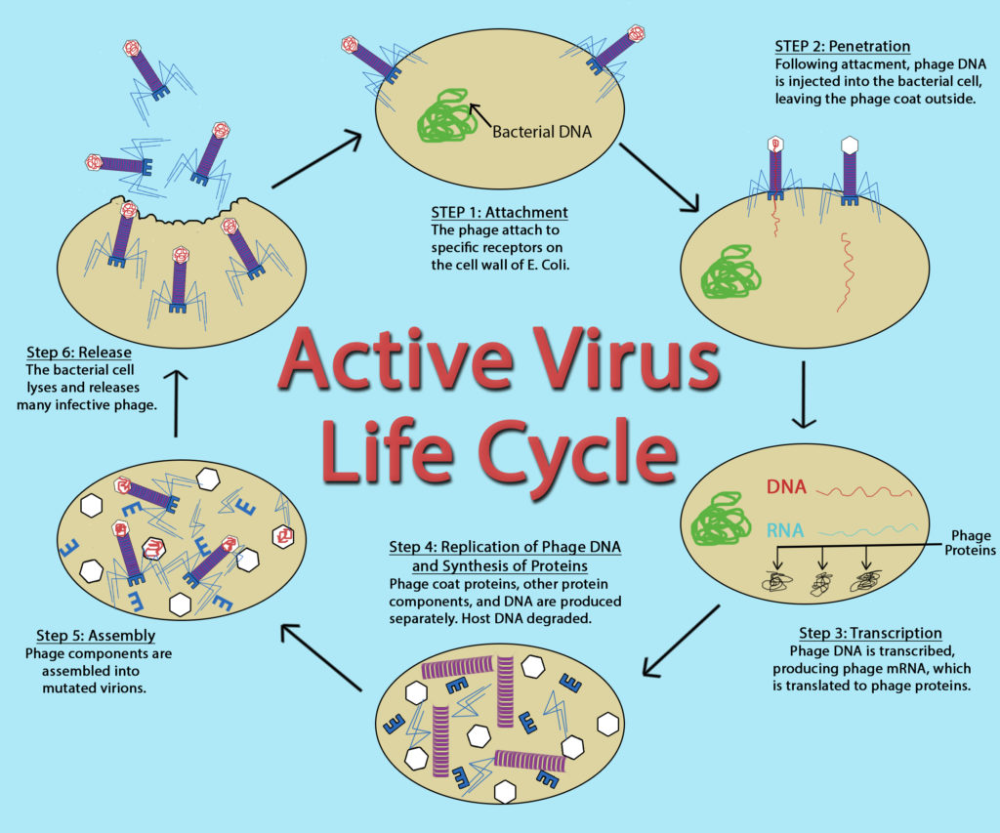

# Virus Cycles
1. introduction- infectious particles that stand on the border between life and non-life. they're much smaller and simpler than cells. But, like any living being, they have genes, and that gives them one of the key properties of life: genetic instructions for self replication at the same time, viruses lack many of life's other key properties: they're not made of cells, and they lack any independent metabolism. Viruses are best described as obligate intracellular parasites.

 